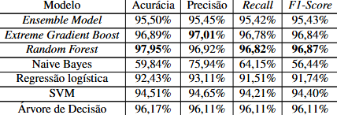

# 📌 PhishML

O **PhishML** surgiu da necessidade de desenvolver uma solução capaz de auxiliar os usuários a detectar se uma aplicação web é **phishing** ou não, com base em características extraídas da sua **URL**. O projeto utiliza **algoritmos e técnicas de aprendizado de máquina**, integrando também verificações adicionais como **typosquatting** e a **API Google Web Risk**.

Durante os testes, o PhishML apresentou resultados positivos, mas também concluiu que características baseadas unicamente nas URLs não são totalmente suficientes para determinar se uma aplicação é phishing ou não — sendo necessário considerar fatores complementares.

O projeto foi apresentado como proposta no **Trabalho de Graduação em Segurança da Informação da FATEC Ourinhos**, recebendo nota **9.50**. 🏆

---

## ⚙️ Como funciona

O PhishML é dividido em três principais módulos:

* **FeatureExtractor.py** → responsável por extrair **30 características** das URLs (técnicas, segurança e engenharia social).
* **ModelHandller.py** → treina e avalia os modelos de machine learning, além de aplicar verificações de segurança adicionais (Google Web Risk, typosquatting, etc.).
* **App.py** → disponibiliza o sistema via **Flask**, permitindo que o usuário insira URLs e receba o diagnóstico (Legítimo/Phishing).

Além disso, o sistema combina diferentes algoritmos de ML, como **Logistic Regression, Decision Tree, Random Forest, SVM e XGBoost**, utilizando também um **Ensemble Model**.

---

## 📊 Principais features extraídas da URL

Alguns exemplos das 30 características analisadas:

* **having IP Address** → verifica se a URL usa IP em vez de domínio.
* **URL Length** → tamanho da URL.
* **Shortening Service** → se a URL está encurtada.
* **Having @ Symbol** → presença de `@` na URL.
* **SSLfinal State** → validade do certificado SSL.
* **Domain Registration Length** → idade do domínio.
* **Favicon** → se está hospedado no mesmo domínio.
* **Google Index** → se o site está indexado no Google.
* **Statistical Report** → consulta via API PhishTank.

Cada função retorna valores que ajudam o modelo a classificar a URL como **legítima ou phishing**.

---

## 🚀 Como executar

### 1️⃣ Clonar o repositório

```bash
git clone https://github.com/felipeporceli/PhishML.git
cd PhishML
```

### 2️⃣ Instalar dependências

```bash
pip install -r dependences.txt
```

### 3️⃣ Treinar modelo e preparar ambiente

```bash
python ModelHandller.py
```

### 4️⃣ Executar aplicação Flask

```bash
python app.py
```

### 5️⃣ Acessar no navegador

```
http://127.0.0.1:5000
```

---

## 🖼️ Resultados



---

## 📚 Tecnologias utilizadas

* Python 3
* Flask + Flask-CORS
* Pandas, NumPy
* Scikit-learn, XGBoost
* Matplotlib, Seaborn
* Requests, BeautifulSoup, tldextract, python-whois, pyOpenSSL
* Levenshtein (detecção de typosquatting)

---

## 📽️ Demonstração

Confira um vídeo de demonstração no Youtube: https://youtu.be/JQuVWQHj4jo

## 📄 Licença

Este projeto é distribuído sob a licença **MIT**.
